<b>Versi Mobile</b>
-login

-dashboard
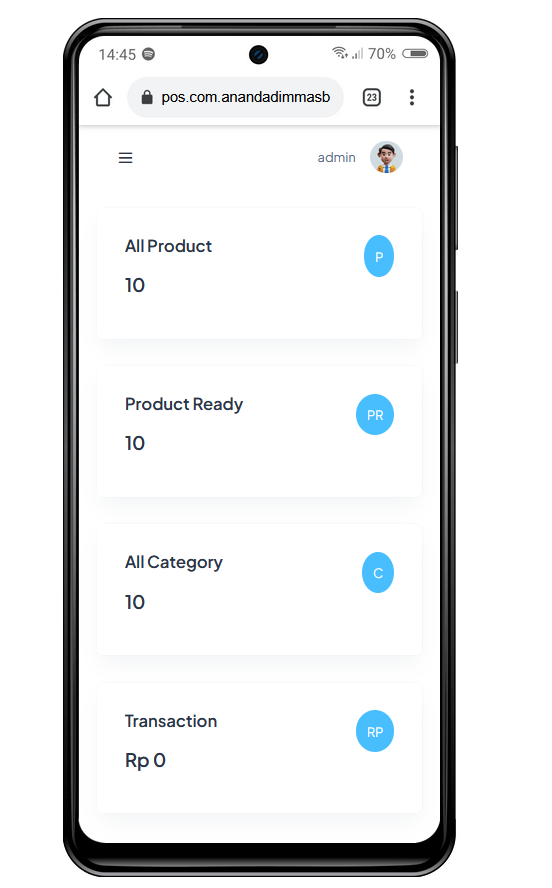
-product
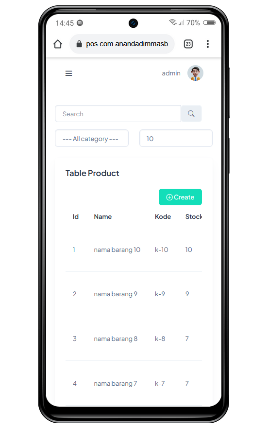
-product edit
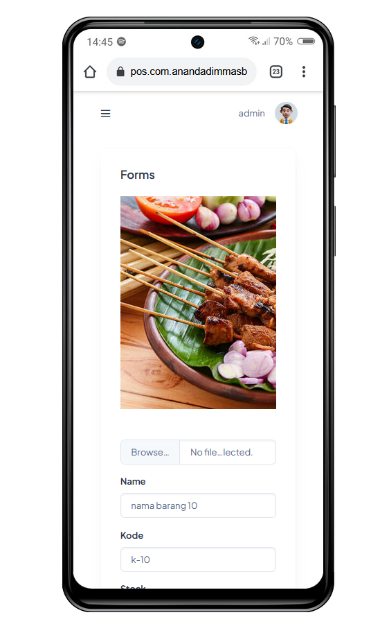
-product create
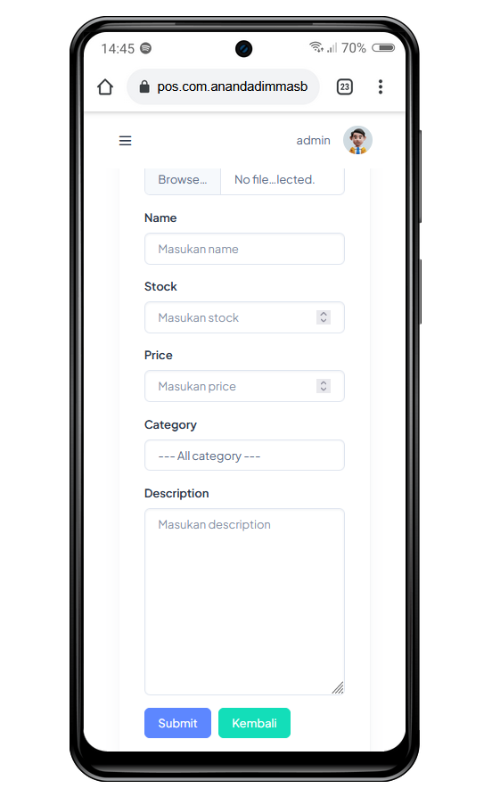
-category
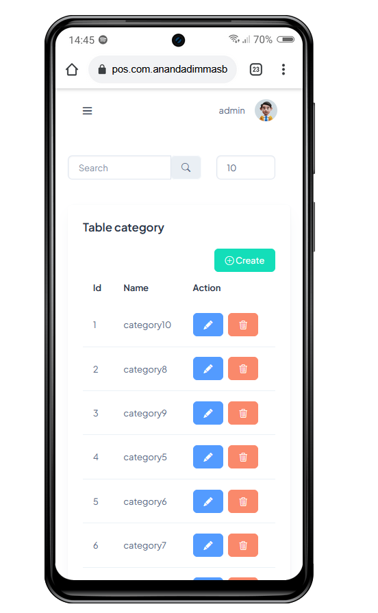
-transaction
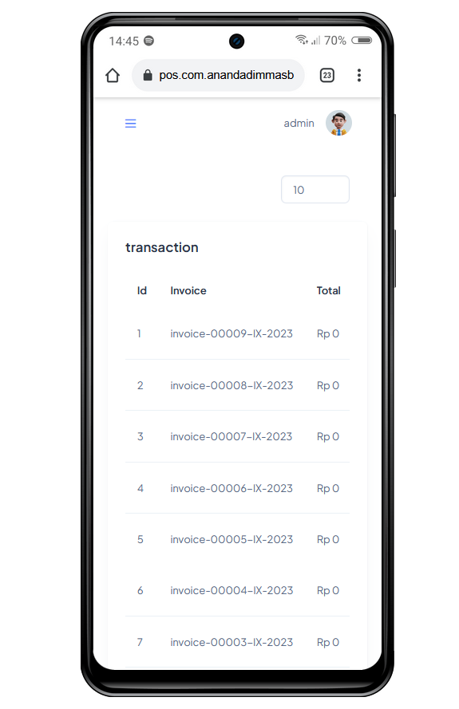
-pos
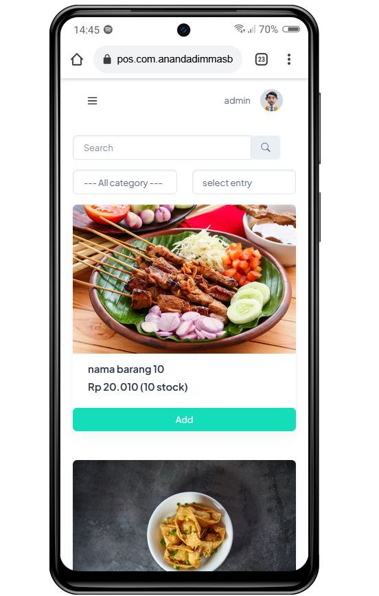

<b>Versi Web</b>
-login
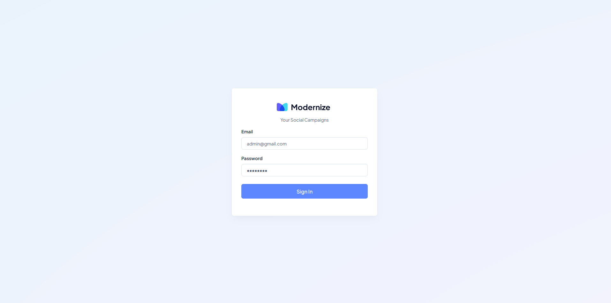
-dashboard
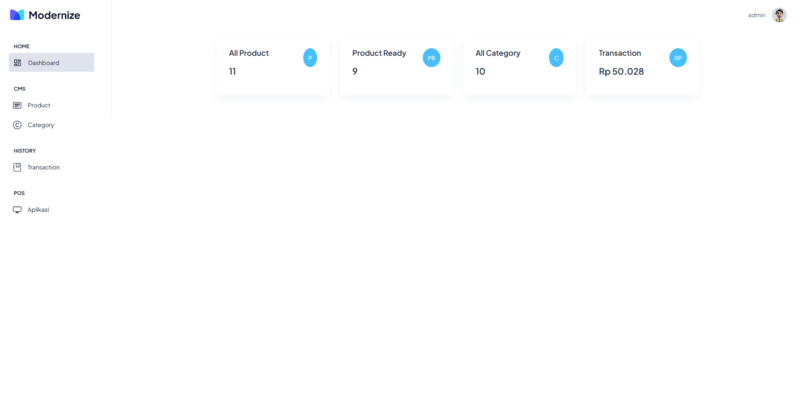
-product
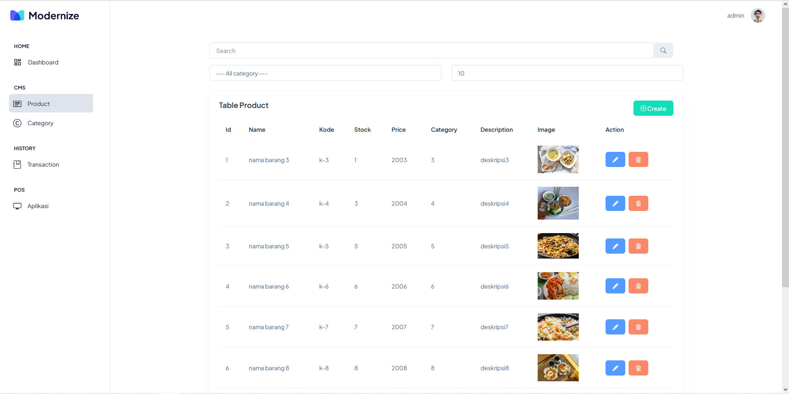
-category
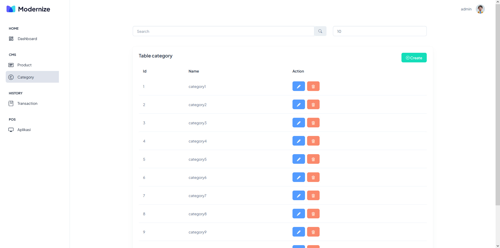
-transaction
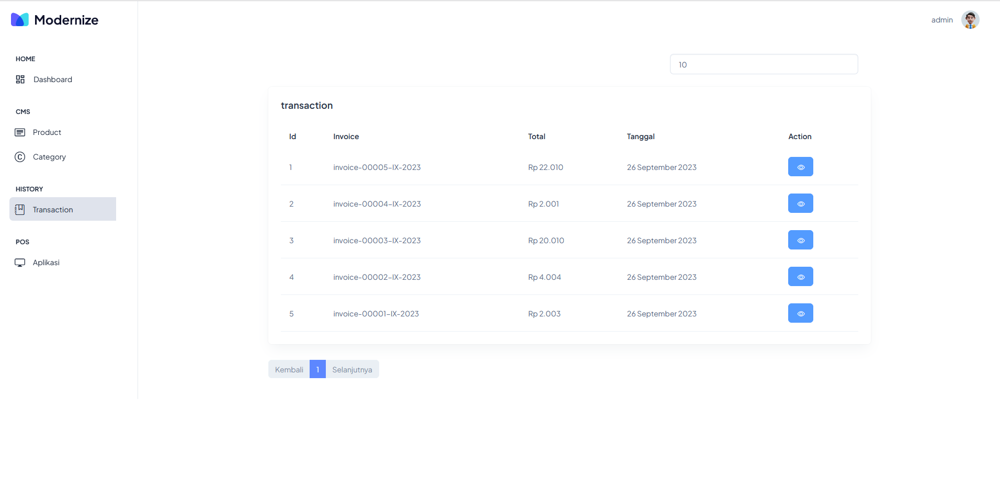
-pos
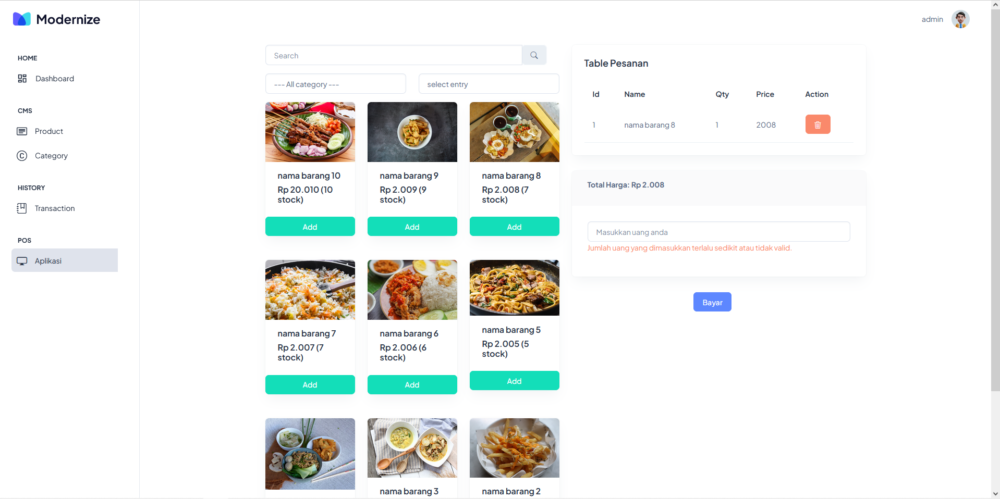

akun login admin

email : admin@gmail.com

password : password

instalation

- npm install

- npm run dev
